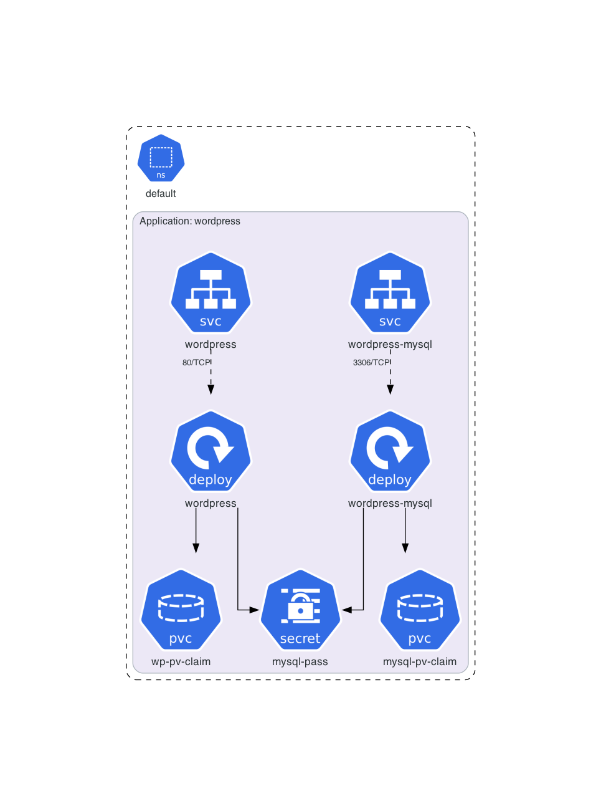
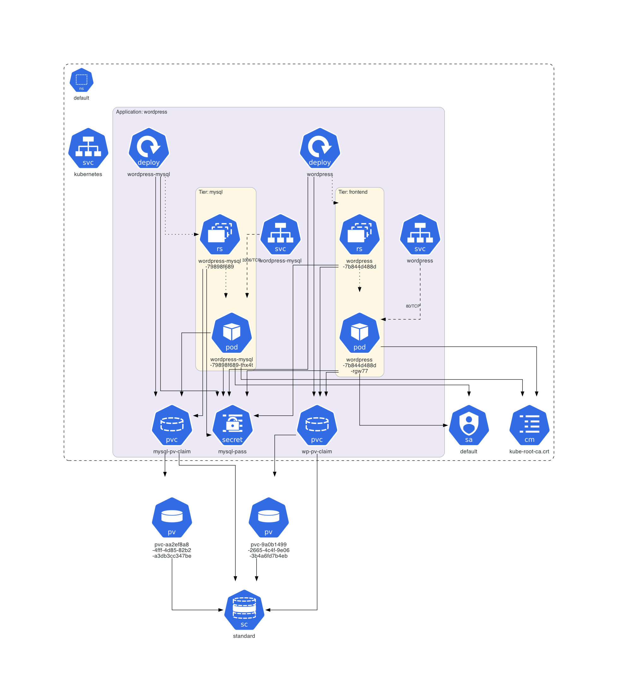

# WordPress Example

This example is based on the **[official Kubernetes WordPress tutorial](https://kubernetes.io/docs/tutorials/stateful-application/mysql-wordpress-persistent-volume/)**.

## Instructions

Generate the Kubernetes architecture diagram for WordPress manifests:
```sh
$ kube-diagrams -o wordpress *.yaml
```

Start a minikube cluster:
```sh
$ minikube start --memory 5120 --cpus=4
```

Deploy the WordPress application:
```sh
$ kubectl apply -f mysql-pass.yaml
$ kubectl apply -f mysql-deployment.yaml
$ kubectl apply -f wordpress-deployment.yaml
```

Wait a few minutes for the WordPress application to be deployed.

Get all Kubernetes resources in the `default` namespace:
```sh
$ kubectl get all,sa,cm,secret,pvc,pv,sc -o=yaml > namespace_default.yml
```

Generate a Kubernetes architecture diagram for the `default` namespace:
```sh
$ kube-diagrams namespace_default.yml
```

Delete the WordPress application:
```sh
$ kubectl delete -f wordpress-deployment.yaml
$ kubectl delete -f mysql-deployment.yaml
$ kubectl delete -f mysql-pass.yaml
```
Generate a custom diagram where the WordPress application is deployed in AWS EKS.
```sh
$ kube-diagrams -c custom_diagram.kd -o wordpress_deployed_in_aws_eks namespace_default.yml
```

## Generated architecture diagrams

Architecture diagram for WordPress manifests:


Architecture diagram for a deployed WordPress instance:


Architecture diagram for a WordPress application deployed in AWS EKS:

